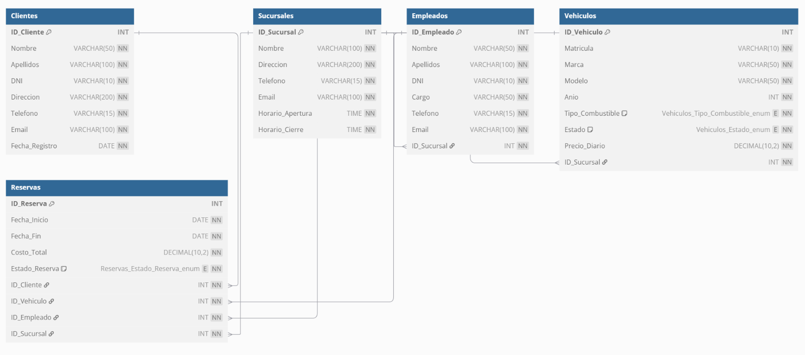

# 📊 SISTEMA DE GESTIÓN DE ALQUILER DE COCHES

# 🚗 CAR RENTAL X

**Nombre del Estudiante:** Javier_Hdez_Glez  
**Fecha de Entrega:** 21-04-2025  
**Asignatura:** Bases de Datos  
**Curso:** 1º DAM  
**Proyecto:** Sistema de Gestión de Alquiler de Coches (CarRentalX)

## ÍNDICE

1. [Introducción](#1-introducción)
2. [Análisis de Requisitos](#2-análisis-de-requisitos)
   1. [Descripción del Problema](#21-descripción-del-problema)
   2. [Objetivos del Sistema](#22-objetivos-del-sistema)
3. [Diseño de la Base de Datos](#3-diseño-de-la-base-de-datos)
   1. [Modelo Conceptual (Entidad-Relación)](#31-modelo-conceptual-entidad-relación)
   2. [Modelo Relacional](#32-modelo-relacional)
4. [Normalización](#4-normalización)
5. [Implementación](#5-implementación)
   1. [Scripts de Creación de Tablas](#51-scripts-de-creación-de-tablas)
   2. [Inserción de Datos de Prueba](#52-inserción-de-datos-de-prueba)
   3. [Consultas SQL](#53-consultas-sql)
6. [Ampliación del Sistema](#6-ampliación-del-sistema)
   1. [Vistas](#61-vistas)
   2. [Triggers](#62-triggers)
7. [Seguridad](#7-seguridad)
8. [Rendimiento](#8-rendimiento)
9. [Mantenimiento](#9-mantenimiento)
10. [Conclusiones](#10-conclusiones)
11. [Glosario](#11-glosario)

## 1. Introducción

Este informe presenta el desarrollo de un sistema de gestión de alquiler de coches para CarRentalX, una empresa líder en el sector. El sistema busca mejorar la eficiencia operativa y proporcionar una experiencia de alquiler más fluida, permitiendo gestionar de manera eficiente la información de clientes, vehículos, reservas, sucursales y empleados.

## 2. Análisis de Requisitos

### 2.1 Descripción del Problema

Actualmente, CarRentalX maneja una gran cantidad de información de manera manual, lo que genera retrasos en los procesos de reserva, devolución y facturación. Se necesita un sistema que permita gestionar de manera eficiente:

- **Clientes**: Información personal y preferencias.
- **Vehículos**: Detalles técnicos, disponibilidad y estado.
- **Reservas**: Fechas, duración, costos y vehículos asociados.
- **Sucursales**: Ubicaciones donde se realizan los alquileres.
- **Empleados**: Personal encargado de gestionar las operaciones.

Además, el sistema debe ser capaz de generar informes sobre vehículos más alquilados, clientes frecuentes e ingresos mensuales por sucursal.

### 2.2 Objetivos del Sistema

- Centralizar la información de clientes, vehículos, reservas, sucursales y empleados.
- Automatizar los procesos de reserva, devolución y facturación.
- Mejorar la eficiencia operativa y la toma de decisiones.
- Generar informes para análisis de datos y toma de decisiones.

## 3. Diseño de la Base de Datos

### 3.1 Modelo Conceptual (Entidad-Relación)

#### Entidades y Atributos

1. **Clientes**

   - ID_Cliente (PK)
   - Nombre
   - Apellidos
   - DNI
   - Dirección
   - Teléfono
   - Email
   - Fecha_Registro

2. **Vehículos**

   - ID_Vehiculo (PK)
   - Matrícula
   - Marca
   - Modelo
   - Año
   - Tipo_Combustible
   - Estado
   - Precio_Diario
   - ID_Sucursal (FK)

3. **Reservas**

   - ID_Reserva (PK)
   - Fecha_Inicio
   - Fecha_Fin
   - Costo_Total
   - Estado_Reserva
   - ID_Cliente (FK)
   - ID_Vehiculo (FK)
   - ID_Empleado (FK)
   - ID_Sucursal (FK)

4. **Sucursales**

   - ID_Sucursal (PK)
   - Nombre
   - Dirección
   - Teléfono
   - Email
   - Horario_Apertura
   - Horario_Cierre

5. **Empleados**
   - ID_Empleado (PK)
   - Nombre
   - Apellidos
   - DNI
   - Cargo
   - Teléfono
   - Email
   - ID_Sucursal (FK)

#### Relaciones

- Un **Cliente** realiza muchas **Reservas** (1:N)
- Un **Vehículo** está asociado a muchas **Reservas** (1:N)
- Una **Sucursal** tiene muchos **Vehículos** (1:N)
- Una **Sucursal** tiene muchos **Empleados** (1:N)
- Un **Empleado** gestiona muchas **Reservas** (1:N)

### 3.2 Modelo Relacional

## 4. Normalización

Se ha aplicado el proceso de normalización a las tablas del sistema para eliminar la redundancia de datos y mejorar la integridad de los mismos. Las tablas cumplen con las siguientes formas normales:

- **Primera Forma Normal (1FN)**: Todas las tablas tienen una clave primaria y no contienen grupos repetitivos.
- **Segunda Forma Normal (2FN)**: Todos los atributos no clave dependen completamente de la clave primaria.
- **Tercera Forma Normal (3FN)**: No existen dependencias transitivas entre los atributos no clave.

## 5. Implementación

### 5.1 Scripts de Creación de Tablas

Se han creado scripts SQL para la creación de las tablas necesarias para el sistema. Estos scripts incluyen la definición de las tablas, sus atributos, claves primarias, claves foráneas y restricciones.

### 5.2 Inserción de Datos de Prueba

Se han creado scripts SQL para la inserción de datos de prueba en las tablas. Estos datos permiten probar el funcionamiento del sistema y realizar consultas de ejemplo.

### 5.3 Consultas SQL

Se han creado consultas SQL para obtener información relevante del sistema, como listado de vehículos disponibles, reservas por cliente, ingresos por sucursal, etc.

## 6. Ampliación del Sistema

### 6.1 Vistas

Se han creado vistas para simplificar consultas frecuentes, como la vista de vehículos disponibles, la vista de reservas activas, etc.

### 6.2 Triggers

Se han creado triggers para automatizar ciertas operaciones, como la actualización del estado de los vehículos después de una reserva o devolución.

## 7. Seguridad

Para garantizar la seguridad de los datos, se han implementado las siguientes medidas:

- Control de acceso basado en roles
- Encriptación de datos sensibles
- Registro de auditoría para operaciones críticas
- Políticas de contraseñas seguras

## 8. Rendimiento

Para optimizar el rendimiento del sistema, se han aplicado las siguientes técnicas:

- Creación de índices en campos frecuentemente consultados
- Optimización de consultas SQL
- Particionamiento de tablas grandes
- Configuración adecuada del servidor de base de datos

## 9. Mantenimiento

Se ha diseñado un plan de mantenimiento que incluye:

- Copias de seguridad periódicas
- Monitorización del rendimiento
- Actualización de índices y estadísticas
- Procedimientos de recuperación ante fallos

## 10. Conclusiones

El sistema de gestión de alquiler de coches para CarRentalX permite centralizar y automatizar la información relacionada con clientes, vehículos, reservas, sucursales y empleados, mejorando así la eficiencia operativa y la toma de decisiones. La implementación de este sistema contribuirá significativamente a la optimización de los procesos de alquiler y a la reducción de errores y retrasos.

## 11. Glosario

- **PK**: Primary Key (Clave Primaria)
- **FK**: Foreign Key (Clave Foránea)
- **SGBD**: Sistema Gestor de Base de Datos
- **SQL**: Structured Query Language (Lenguaje de Consulta Estructurado)
- **Trigger**: Disparador, procedimiento que se ejecuta automáticamente en respuesta a ciertos eventos
