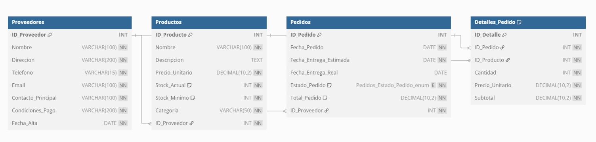

# 📊 SISTEMA DE GESTIÓN DE COMPRAS

# 🛒 GLOBALMART LTDA.

**Nombre del Estudiante:** Javier_Hdez_Glez  
**Fecha de Entrega:** 21-04-2025  
**Asignatura:** Bases de Datos  
**Curso:** 1º DAM  
**Proyecto:** Sistema de Gestión de Compras (GlobalMart Ltda.)

## ÍNDICE

1. [Introducción](#1-introducción)
2. [Análisis de Requisitos](#2-análisis-de-requisitos)
   1. [Descripción del Problema](#21-descripción-del-problema)
   2. [Objetivos del Sistema](#22-objetivos-del-sistema)
3. [Diseño de la Base de Datos](#3-diseño-de-la-base-de-datos)
   1. [Modelo Conceptual (Entidad-Relación)](#31-modelo-conceptual-entidad-relación)
   2. [Modelo Relacional](#32-modelo-relacional)
4. [Normalización](#4-normalización)
5. [Implementación](#5-implementación)
   1. [Scripts de Creación de Tablas](#51-scripts-de-creación-de-tablas)
   2. [Inserción de Datos de Prueba](#52-inserción-de-datos-de-prueba)
   3. [Consultas SQL](#53-consultas-sql)
6. [Ampliación del Sistema](#6-ampliación-del-sistema)
   1. [Vistas](#61-vistas)
   2. [Triggers](#62-triggers)
7. [Seguridad](#7-seguridad)
8. [Rendimiento](#8-rendimiento)
9. [Mantenimiento](#9-mantenimiento)
10. [Conclusiones](#10-conclusiones)
11. [Glosario](#11-glosario)

## 1. Introducción

Este informe presenta el desarrollo de un sistema de gestión de compras para GlobalMart Ltda., una empresa líder en el sector de distribución y venta de productos. El sistema busca optimizar los procesos de compra y garantizar un mejor control sobre las actividades de adquisición, permitiendo gestionar de manera eficiente la información de proveedores, productos y pedidos.

## 2. Análisis de Requisitos

### 2.1 Descripción del Problema

Actualmente, GlobalMart Ltda. enfrenta desafíos como:

- Falta de integración entre proveedores, productos y pedidos.
- Dificultad para rastrear el historial de compras y el estado de los pedidos.
- Gestión manual de proveedores y productos, lo que genera errores y retrasos.

Se necesita un sistema que permita centralizar y automatizar la información relacionada con proveedores, productos y pedidos, mejorando así la eficiencia operativa y la toma de decisiones.

### 2.2 Objetivos del Sistema

- Diseñar e implementar un sistema de gestión de compras que administre eficientemente la información sobre:
  - Proveedores: Datos de contacto, productos suministrados y condiciones de pago.
  - Productos: Detalles de inventario, precios y categorías.
  - Pedidos: Registro de compras, estado de los pedidos y relación con proveedores y productos.

## 3. Diseño de la Base de Datos

### 3.1 Modelo Conceptual (Entidad-Relación)

#### Entidades y Atributos

1. **Proveedores**

   - ID_Proveedor (PK)
   - Nombre
   - Direccion
   - Telefono
   - Email
   - Contacto_Principal
   - Condiciones_Pago
   - Fecha_Alta

2. **Productos**

   - ID_Producto (PK)
   - Nombre
   - Descripcion
   - Precio_Unitario
   - Stock_Actual
   - Stock_Minimo
   - Categoria
   - ID_Proveedor (FK)

3. **Pedidos**

   - ID_Pedido (PK)
   - Fecha_Pedido
   - Fecha_Entrega_Estimada
   - Fecha_Entrega_Real
   - Estado_Pedido
   - Total_Pedido
   - ID_Proveedor (FK)

4. **Detalles_Pedido**
   - ID_Detalle (PK)
   - ID_Pedido (FK)
   - ID_Producto (FK)
   - Cantidad
   - Precio_Unitario
   - Subtotal

#### Relaciones

- Un **Proveedor** suministra muchos **Productos** (1:N)
- Un **Proveedor** recibe muchos **Pedidos** (1:N)
- Un **Pedido** contiene muchos **Detalles_Pedido** (1:N)
- Un **Producto** aparece en muchos **Detalles_Pedido** (1:N)

### 3.2 Modelo Relacional

## 4. Normalización

Se ha aplicado el proceso de normalización a las tablas del sistema para eliminar la redundancia de datos y mejorar la integridad de los mismos. Las tablas cumplen con las siguientes formas normales:

- **Primera Forma Normal (1FN)**: Todas las tablas tienen una clave primaria y no contienen grupos repetitivos.
- **Segunda Forma Normal (2FN)**: Todos los atributos no clave dependen completamente de la clave primaria.
- **Tercera Forma Normal (3FN)**: No existen dependencias transitivas entre los atributos no clave.

## 5. Implementación

### 5.1 Scripts de Creación de Tablas

Se han creado scripts SQL para la creación de las tablas necesarias para el sistema. Estos scripts incluyen la definición de las tablas, sus atributos, claves primarias, claves foráneas y restricciones.

### 5.2 Inserción de Datos de Prueba

Se han creado scripts SQL para la inserción de datos de prueba en las tablas. Estos datos permiten probar el funcionamiento del sistema y realizar consultas de ejemplo.

### 5.3 Consultas SQL

Se han creado consultas SQL para obtener información relevante del sistema, como listado de proveedores, productos por proveedor, pedidos pendientes, etc.

## 6. Ampliación del Sistema

### 6.1 Vistas

Se han creado vistas para simplificar consultas frecuentes, como la vista de productos con bajo stock, la vista de pedidos pendientes, etc.

### 6.2 Triggers

Se han creado triggers para automatizar ciertas operaciones, como la actualización del stock de productos después de un pedido o la actualización del total de un pedido cuando se modifican sus detalles.

## 7. Seguridad

Para garantizar la seguridad de los datos, se han implementado las siguientes medidas:

- Control de acceso basado en roles
- Encriptación de datos sensibles
- Registro de auditoría para operaciones críticas
- Políticas de contraseñas seguras

## 8. Rendimiento

Para optimizar el rendimiento del sistema, se han aplicado las siguientes técnicas:

- Creación de índices en campos frecuentemente consultados
- Optimización de consultas SQL
- Particionamiento de tablas grandes
- Configuración adecuada del servidor de base de datos

## 9. Mantenimiento

Se ha diseñado un plan de mantenimiento que incluye:

- Copias de seguridad periódicas
- Monitorización del rendimiento
- Actualización de índices y estadísticas
- Procedimientos de recuperación ante fallos

## 10. Conclusiones

El sistema de gestión de compras para GlobalMart Ltda. permite centralizar y automatizar la información relacionada con proveedores, productos y pedidos, mejorando así la eficiencia operativa y la toma de decisiones. La implementación de este sistema contribuirá significativamente a la optimización de los procesos de compra y a la reducción de errores y retrasos.

## 11. Glosario

- **PK**: Primary Key (Clave Primaria)
- **FK**: Foreign Key (Clave Foránea)
- **SGBD**: Sistema Gestor de Base de Datos
- **SQL**: Structured Query Language (Lenguaje de Consulta Estructurado)
- **Trigger**: Disparador, procedimiento que se ejecuta automáticamente en respuesta a ciertos eventos
