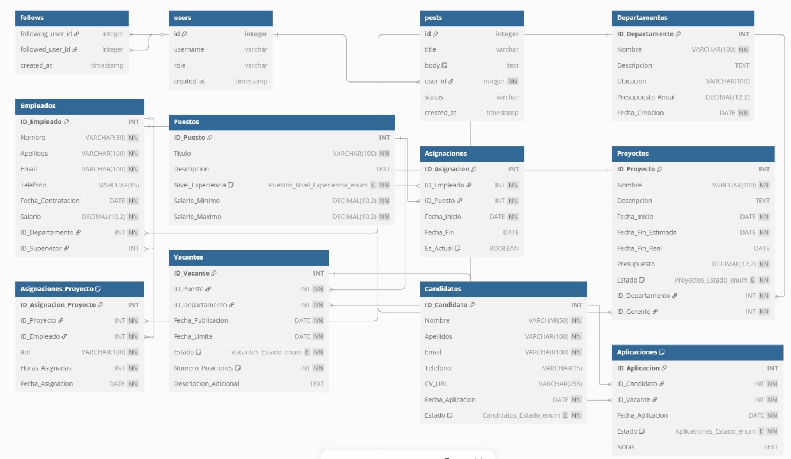

# 📊 SISTEMA DE GESTIÓN DE EMPLEADOS

# 👩‍💼 TECH SOLUTIONS INC.

**Nombre del Estudiante:** Javier_Hdez_Glez  
**Fecha de Entrega:** 21-04-2025  
**Asignatura:** Bases de Datos  
**Curso:** 1º DAM  
**Proyecto:** Sistema de Gestión de Empleados (TechSolutions Inc.)

## ÍNDICE

1. [Introducción](#1-introducción)
2. [Análisis de Requisitos](#2-análisis-de-requisitos)
   1. [Descripción del Problema](#21-descripción-del-problema)
   2. [Objetivos del Sistema](#22-objetivos-del-sistema)
3. [Diseño de la Base de Datos](#3-diseño-de-la-base-de-datos)
   1. [Modelo Conceptual (Entidad-Relación)](#31-modelo-conceptual-entidad-relación)
   2. [Modelo Relacional](#32-modelo-relacional)
4. [Normalización](#4-normalización)
5. [Implementación](#5-implementación)
   1. [Scripts de Creación de Tablas](#51-scripts-de-creación-de-tablas)
   2. [Inserción de Datos de Prueba](#52-inserción-de-datos-de-prueba)
   3. [Consultas SQL](#53-consultas-sql)
6. [Ampliación del Sistema](#6-ampliación-del-sistema)
   1. [Vistas](#61-vistas)
   2. [Triggers](#62-triggers)
7. [Seguridad](#7-seguridad)
8. [Rendimiento](#8-rendimiento)
9. [Mantenimiento](#9-mantenimiento)
10. [Conclusiones](#10-conclusiones)
11. [Glosario](#11-glosario)

## 1. Introducción

Este informe presenta el desarrollo de un sistema de gestión de empleados para TechSolutions Inc., una empresa comprometida con la eficiencia y la organización en la gestión de sus recursos humanos. El sistema busca mejorar la administración de la información de empleados, departamentos y puestos de trabajo, permitiendo una gestión más efectiva y centralizada.

## 2. Análisis de Requisitos

### 2.1 Descripción del Problema

Actualmente, TechSolutions Inc. enfrenta desafíos como:

- Falta de integración entre la información de empleados, departamentos y puestos.
- Dificultad para acceder a datos históricos y actualizados sobre la estructura organizacional.
- Gestión manual de nóminas, evaluaciones y asignaciones de roles, lo que genera errores y retrasos.

Se necesita un sistema que permita centralizar y automatizar la información relacionada con empleados, departamentos y puestos de trabajo, mejorando así la eficiencia operativa y la toma de decisiones.

### 2.2 Objetivos del Sistema

- Diseñar e implementar un sistema de gestión de empleados que administre eficientemente la información sobre:
  - Empleados: Datos personales, roles y evaluaciones.
  - Departamentos: Estructura organizacional y asignación de empleados.
  - Puestos de trabajo: Descripción de roles, salarios y responsabilidades.

## 3. Diseño de la Base de Datos

### 3.1 Modelo Conceptual (Entidad-Relación)

#### Entidades y Atributos

1. **Empleados**

   - ID_Empleado (PK)
   - Nombre
   - Apellidos
   - DNI
   - Fecha_Nacimiento
   - Direccion
   - Telefono
   - Email
   - Fecha_Contratacion
   - ID_Departamento (FK)
   - ID_Puesto (FK)

2. **Departamentos**

   - ID_Departamento (PK)
   - Nombre
   - Descripcion
   - Ubicacion
   - Presupuesto_Anual
   - ID_Jefe_Departamento (FK)

3. **Puestos**

   - ID_Puesto (PK)
   - Titulo
   - Descripcion
   - Salario_Minimo
   - Salario_Maximo
   - Nivel_Jerarquico

4. **Evaluaciones**
   - ID_Evaluacion (PK)
   - ID_Empleado (FK)
   - Fecha_Evaluacion
   - Puntuacion
   - Comentarios
   - ID_Evaluador (FK)

#### Relaciones

- Un **Empleado** pertenece a un **Departamento** (N:1)
- Un **Empleado** tiene un **Puesto** (N:1)
- Un **Departamento** puede tener varios **Puestos** (1:N)
- Un **Empleado** puede tener varias **Evaluaciones** (1:N)
- Un **Empleado** puede ser el jefe de un **Departamento** (1:1)

### 3.2 Modelo Relacional

## 4. Normalización

Se ha aplicado el proceso de normalización a las tablas del sistema para eliminar la redundancia de datos y mejorar la integridad de los mismos. Las tablas cumplen con las siguientes formas normales:

- **Primera Forma Normal (1FN)**: Todas las tablas tienen una clave primaria y no contienen grupos repetitivos.
- **Segunda Forma Normal (2FN)**: Todos los atributos no clave dependen completamente de la clave primaria.
- **Tercera Forma Normal (3FN)**: No existen dependencias transitivas entre los atributos no clave.

## 5. Implementación

### 5.1 Scripts de Creación de Tablas

Se han creado scripts SQL para la creación de las tablas necesarias para el sistema. Estos scripts incluyen la definición de las tablas, sus atributos, claves primarias, claves foráneas y restricciones.

### 5.2 Inserción de Datos de Prueba

Se han creado scripts SQL para la inserción de datos de prueba en las tablas. Estos datos permiten probar el funcionamiento del sistema y realizar consultas de ejemplo.

### 5.3 Consultas SQL

Se han creado consultas SQL para obtener información relevante del sistema, como listado de empleados por departamento, puestos vacantes, etc.

## 6. Ampliación del Sistema

### 6.1 Vistas

Se han creado vistas para simplificar consultas frecuentes, como la vista de empleados por departamento, la vista de salarios por puesto, etc.

### 6.2 Triggers

Se han creado triggers para automatizar ciertas operaciones, como la actualización del salario promedio por departamento o la actualización del historial de cambios de puesto de un empleado.

## 7. Seguridad

Para garantizar la seguridad de los datos, se han implementado las siguientes medidas:

- Control de acceso basado en roles
- Encriptación de datos sensibles
- Registro de auditoría para operaciones críticas
- Políticas de contraseñas seguras

## 8. Rendimiento

Para optimizar el rendimiento del sistema, se han aplicado las siguientes técnicas:

- Creación de índices en campos frecuentemente consultados
- Optimización de consultas SQL
- Particionamiento de tablas grandes
- Configuración adecuada del servidor de base de datos

## 9. Mantenimiento

Se ha diseñado un plan de mantenimiento que incluye:

- Copias de seguridad periódicas
- Monitorización del rendimiento
- Actualización de índices y estadísticas
- Procedimientos de recuperación ante fallos

## 10. Conclusiones

El sistema de gestión de empleados para TechSolutions Inc. permite centralizar y automatizar la información relacionada con empleados, departamentos y puestos de trabajo, mejorando así la eficiencia operativa y la toma de decisiones. La implementación de este sistema contribuirá significativamente a la optimización de los procesos de gestión de recursos humanos y a la reducción de errores y retrasos.

## 11. Glosario

- **PK**: Primary Key (Clave Primaria)
- **FK**: Foreign Key (Clave Foránea)
- **SGBD**: Sistema Gestor de Base de Datos
- **SQL**: Structured Query Language (Lenguaje de Consulta Estructurado)
- **Trigger**: Disparador, procedimiento que se ejecuta automáticamente en respuesta a ciertos eventos
