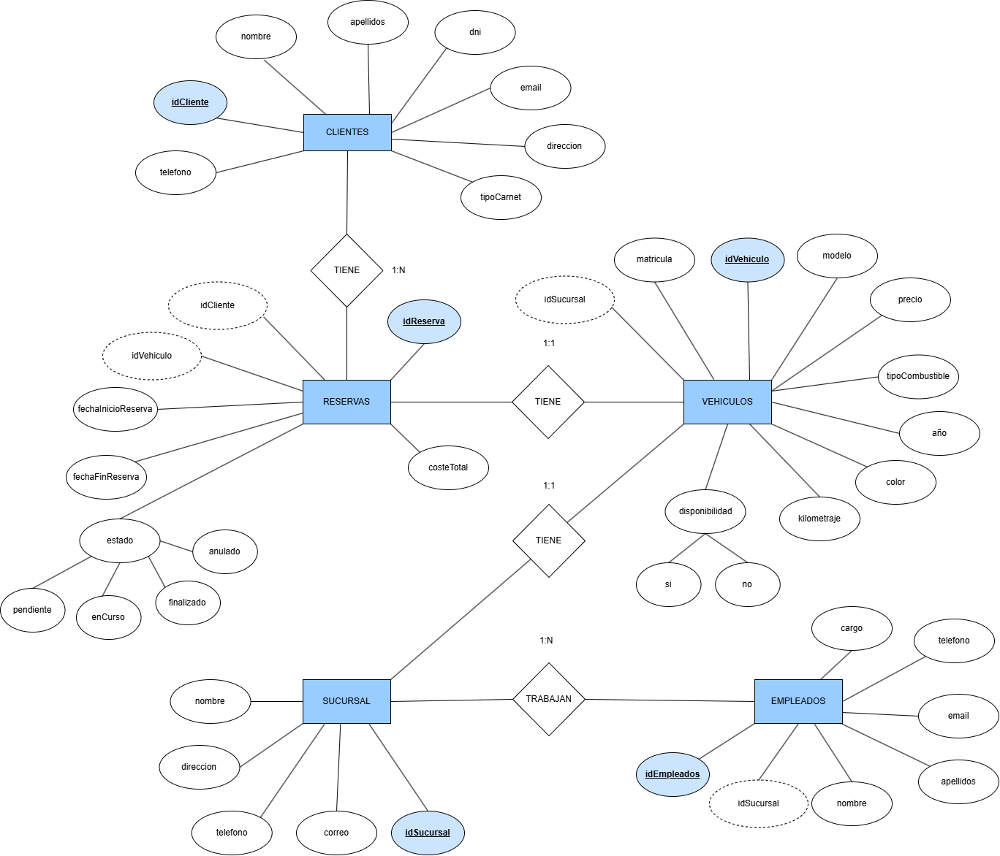

## 5. Modelo conceptual



## 6. Modelo relacional


## 7. Implementación en MySQL

### 1. Creación de tablas

```sql
-- MySQL Workbench Forward Engineering

SET @OLD_UNIQUE_CHECKS=@@UNIQUE_CHECKS, UNIQUE_CHECKS=0;
SET @OLD_FOREIGN_KEY_CHECKS=@@FOREIGN_KEY_CHECKS, FOREIGN_KEY_CHECKS=0;
SET @OLD_SQL_MODE=@@SQL_MODE, SQL_MODE='ONLY_FULL_GROUP_BY,STRICT_TRANS_TABLES,NO_ZERO_IN_DATE,NO_ZERO_DATE,ERROR_FOR_DIVISION_BY_ZERO,NO_ENGINE_SUBSTITUTION';

-- -----------------------------------------------------
-- Schema CarRentalX
-- -----------------------------------------------------

-- -----------------------------------------------------
-- Schema CarRentalX
-- -----------------------------------------------------
CREATE SCHEMA IF NOT EXISTS `CarRentalX` DEFAULT CHARACTER SET utf8 ;
USE `CarRentalX` ;

-- -----------------------------------------------------
-- Table `CarRentalX`.`clientes`
-- -----------------------------------------------------
CREATE TABLE IF NOT EXISTS `CarRentalX`.`clientes` (
  `idClientes` INT NOT NULL AUTO_INCREMENT,
  `nombre` VARCHAR(45) NOT NULL,
  `apellidos` VARCHAR(45) NOT NULL,
  `dni` VARCHAR(45) NOT NULL,
  `email` VARCHAR(45) NOT NULL,
  `telefono` INT(10) NOT NULL,
  `tipoCarnet` SET('A', 'B', 'C', 'D', 'E', 'AM', 'A1', 'A2', 'B1', 'C1', 'D1', 'BE', 'C1E', 'CE', 'D1E', 'DE') NOT NULL,
  PRIMARY KEY (`idClientes`))
ENGINE = InnoDB;


-- -----------------------------------------------------
-- Table `CarRentalX`.`vehiculos`
-- -----------------------------------------------------
CREATE TABLE IF NOT EXISTS `CarRentalX`.`vehiculos` (
  `idVehiculo` INT NOT NULL AUTO_INCREMENT,
  `matricula` VARCHAR(9) NOT NULL,
  `modelo` VARCHAR(45) NOT NULL,
  `año` SMALLINT(4) NOT NULL,
  `color` VARCHAR(45) NULL,
  `tipoCombustible` SET("gasolina", "diesel", "electrico", "hibrido", "gas", "hidrogeno") NOT NULL,
  `precio` DOUBLE NOT NULL,
  `disponibilidad` ENUM("SI", "NO") NOT NULL,
  `idSucursal` INT NOT NULL,
  PRIMARY KEY (`idVehiculo`, `idSucursal`))
ENGINE = InnoDB;


-- -----------------------------------------------------
-- Table `CarRentalX`.`reservas`
-- -----------------------------------------------------
CREATE TABLE IF NOT EXISTS `CarRentalX`.`reservas` (
  `idReserva` INT NOT NULL AUTO_INCREMENT,
  `costeTotal` DOUBLE NOT NULL,
  `fechaInicioReserva` DATETIME NOT NULL,
  `fechaFinReserva` DATETIME NOT NULL,
  `estado` ENUM("pendiente", "enCurso", "finalizado", "anulado") NOT NULL,
  `idClientes` INT NOT NULL,
  `idVehiculo` INT NOT NULL,
  `idSucursal` INT NOT NULL,
  PRIMARY KEY (`idReserva`),
  INDEX `fk_reservas_clientes1_idx` (`idClientes` ASC),
  INDEX `fk_reservas_vehiculos1_idx` (`idVehiculo` ASC, `idSucursal` ASC),
  CONSTRAINT `fk_reservas_clientes1`
    FOREIGN KEY (`idClientes`)
    REFERENCES `CarRentalX`.`clientes` (`idClientes`)
    ON DELETE NO ACTION
    ON UPDATE NO ACTION,
  CONSTRAINT `fk_reservas_vehiculos1`
    FOREIGN KEY (`idVehiculo` , `idSucursal`)
    REFERENCES `CarRentalX`.`vehiculos` (`idVehiculo` , `idSucursal`)
    ON DELETE NO ACTION
    ON UPDATE NO ACTION)
ENGINE = InnoDB;


-- -----------------------------------------------------
-- Table `CarRentalX`.`sucursal`
-- -----------------------------------------------------
CREATE TABLE IF NOT EXISTS `CarRentalX`.`sucursal` (
  `idSucursal` INT NOT NULL AUTO_INCREMENT,
  `nombre` VARCHAR(45) NOT NULL,
  `direccion` VARCHAR(45) NOT NULL,
  `telefono` INT(10) NOT NULL,
  `correo` VARCHAR(45) NOT NULL,
  PRIMARY KEY (`idSucursal`))
ENGINE = InnoDB;


-- -----------------------------------------------------
-- Table `CarRentalX`.`empleados`
-- -----------------------------------------------------
CREATE TABLE IF NOT EXISTS `CarRentalX`.`empleados` (
  `idEmpleados` INT NOT NULL AUTO_INCREMENT,
  `cargo` VARCHAR(45) NOT NULL,
  `nombre` VARCHAR(45) NOT NULL,
  `apellidos` VARCHAR(45) NOT NULL,
  `email` VARCHAR(45) NOT NULL,
  `telefono` INT(10) NOT NULL,
  `idSucursal` INT NOT NULL,
  PRIMARY KEY (`idEmpleados`),
  INDEX `fk_empleados_sucursal1_idx` (`idSucursal` ASC),
  CONSTRAINT `fk_empleados_sucursal1`
    FOREIGN KEY (`idSucursal`)
    REFERENCES `CarRentalX`.`sucursal` (`idSucursal`)
    ON DELETE NO ACTION
    ON UPDATE NO ACTION)
ENGINE = InnoDB;


SET SQL_MODE=@OLD_SQL_MODE;
SET FOREIGN_KEY_CHECKS=@OLD_FOREIGN_KEY_CHECKS;
SET UNIQUE_CHECKS=@OLD_UNIQUE_CHECKS;


### 2. Inserción de datos de prueba

#### Seleccionar la base de datos correspondiente

``` sql
Use carrentalx;
```
#### Insertar datos de clientes
``` sql
INSERT INTO clientes 

VALUES   

(DEFAULT, 'Juan', 'Pérez', '12345678A', 'juan.perez@gmail.com', 612345678, 'A'),  

(DEFAULT, 'Ana', 'García', '87654321B', 'ana.garcia@gmail.com', 623456789, 'B'),  

(DEFAULT, 'Carlos', 'López', '11223344C', 'carlos.lopez@gmail.com', 634567890, 'C'), 

(DEFAULT, 'Manuel', 'Jiménez', '3215678A', 'manuel.jimenez@gmail.com', 652145423, 'A,B'); 
```
#### Insertar datos de sucursal
``` sql
INSERT INTO sucursal 

VALUES  

(DEFAULT, 'Sucursal Central', 'Calle Mayor 123', 912345678, 'central@gmail.com'), 

(DEFAULT, 'Sucursal Norte', 'Calle Norte 456', 923456789, 'norte@gmail.com'), 

(DEFAULT, 'Sucursal Sur', 'Calle Sur 789', 934567890, 'sur@gmail.com'); 
```
#### Insertar datos de vehículos
``` sql
INSERT INTO vehiculos 

VALUES  

(DEFAULT, '1234ABC', 'Ford Fiesta', 2020, 'Rojo', 'gasolina', 100.5, 'SI', 1), 

(DEFAULT, '5678DEF', 'BMW X5', 2019, 'Azul', 'diesel', 250.75, 'NO', 2), 

(DEFAULT, '9101GHI', 'Tesla Model 3', 2021, 'Negro', 'electrico', 500.0, 'SI', 3), 

(DEFAULT, '123ABC', 'Toyota Corolla', 2020, 'Rojo', 'gasolina', 35.99, 'SI', 1), 

(DEFAULT, '456DEF', 'Ford Focus', 2021, 'Azul', 'gasolina,diesel', 40.50, 'SI', 2); 
```
#### Insertar datos de reservas
``` sql
INSERT INTO reservas 

VALUES  

(DEFAULT, 150.0, '2025-03-10 10:00:00', '2025-03-12 10:00:00', 'pendiente', 1, 1, 1),

(DEFAULT, 220.0, '2025-03-10 12:00:00', '2025-03-12 10:00:00', 'pendiente', 1, 1, 1),

(DEFAULT, 220.0, '2025-03-10 12:00:00', '2025-03-12 10:00:00', 'pendiente', 1, 1, 1), 

(DEFAULT, 200.5, '2025-03-15 12:00:00', '2025-03-18 12:00:00', 'enCurso', 2, 2, 2), 

(DEFAULT, 350.0, '2025-03-20 09:00:00', '2025-03-22 09:00:00', 'finalizado', 3, 3, 3), 

(DEFAULT, 350.0, '2025-03-24 19:00:00', '2025-03-28 09:00:00', 'anulado', 3, 3, 3); 
```
#### Insertar datos de empleados
``` sql
INSERT INTO empleados 

VALUES  

(DEFAULT, 'Gerente', 'María', 'Martínez', 'maria.martinez@gmail.com', 611223344, 1), 

(DEFAULT, 'Asesor', 'Pedro', 'Gómez', 'pedro.gomez@gmail.com', 622334455, 2), 

(DEFAULT, 'Recepcionista', 'Lucía', 'Sánchez', 'lucia.sanchez@gmail.com', 633445566, 3) 
```

## 8. Consultas propuestas

```sql
USE carrentalx;
#### 1. Listar todos los clientes con su información personal.
SELECT * 
FROM clientes;

#### 2. Buscar un cliente por su DNI, nombre o email.
SELECT * 
FROM clientes
WHERE email = "juan.perez@gmail.com";

#### 3. Contar cuántos clientes hay registrados.
SELECT COUNT(*) 
FROM clientes;

#### 4. Obtener los clientes que han realizado al menos una reserva.
SELECT DISTINCT idClientes 
FROM clientes
JOIN reservas 
ON clientes.idClientes = reservas.clientes_idClientes;

#### 5. Listar los clientes con más reservas realizadas.
SELECT idClientes, nombre, COUNT(idReserva) 
FROM clientes
JOIN reservas 
ON clientes.idClientes = reservas.clientes_idClientes
GROUP BY clientes.idClientes DESC;

#### 6. Listar todos los vehículos con sus detalles técnicos.
SELECT * FROM vehiculos;

#### 7. Buscar un vehículo cuya matrícula empiece por 1.
 SELECT * FROM vehiculos
 WHERE matricula 
 LIKE ("1%");
 
#### 8. Contar cuántos vehículos hay de cada tipo de combustible.
SELECT idVehiculos, tipoCombustible, COUNT(tipoCombustible) 
FROM vehiculos 
GROUP BY tipoCombustible;

#### 9. Obtener los vehículos disponibles en una sucursal específica.
SELECT * 
FROM vehiculos 
WHERE disponibilidad = "SI";

#### 10. Obtener los ingresos de los vehiculos ordenados de manera descendente.
SELECT idVehiculos, modelo, SUM(reservas.costeTotal) 
FROM vehiculos 
JOIN reservas 
ON vehiculos.idVehiculos = reservas.vehiculos_idVehiculos
GROUP BY vehiculos.idVehiculos DESC;

#### 11. Obtener todas las reservas realizadas con fechas de inicio y fin.
SELECT *
FROM reservas
WHERE fechaInicioReserva != "" 
AND fechaFinReserva != "";

#### 12. Contar cuántas reservas hay en cada estado (pendiente, en curso, finalizado, anulado).
SELECT idReserva, estado, COUNT(estado) 
FROM reservas 
GROUP BY estado;

#### 13. Obtener las reservas pendientes en este momento.
SELECT *
FROM reservas 
WHERE estado = "pendiente";

#### 14. Calcular el ingreso total generado por todas las reservas.
SELECT SUM(reservas.costeTotal)
FROM reservas 
WHERE estado != "anulado" AND estado != "pendiente";

#### 15. Contar cuántas reservas se han realizado por mes/año.
SELECT DAY(fechaInicioReserva) AS dia,  
COUNT(*) AS num_reservas
FROM reservas
GROUP BY dia;

#### 16. Listar todas las sucursales con su información.
SELECT * FROM sucursal;

#### 17. Contar cuántos vehículos hay en cada sucursal.
SELECT sucursal.idSucursal, sucursal.nombre, COUNT(vehiculos.idVehiculos) 
FROM sucursal
LEFT JOIN vehiculos ON sucursal.idSucursal = vehiculos.sucursal_idSucursal
GROUP BY sucursal.idSucursal, sucursal.nombre;

#### 18. Determinar qué sucursal ha generado más ingresos en reservas.
SELECT sucursal.idSucursal, sucursal.nombre, SUM(reservas.costeTotal) 
FROM sucursal
JOIN reservas ON sucursal.idSucursal = reservas.vehiculos_idSucursal
JOIN vehiculos ON sucursal.idSucursal = vehiculos.sucursal_idSucursal
WHERE reservas.estado = 'enCurso' OR reservas.estado = 'finalizado'
GROUP BY sucursal.idSucursal;

#### 19. Listar los empleados asignados a cada sucursal.
SELECT idEmpleados, nombre, sucursal_idSucursal 
FROM empleados;

#### 20. Identificar sucursales con reservas registradas para el 10 de marzo de 2025.
SELECT * FROM reservas 
WHERE fechaInicioReserva
LIKE ("%2025-03-10%");

#### 21. Lista todos los empleados.
SELECT * 
FROM empleados;

#### 22. Listar todos los empleados con su cargo y sucursal asignada.
SELECT nombre, cargo, sucursal_idSucursal FROM empleados;

#### 23. Buscar empleados por nombre.
SELECT * 
FROM empleados
WHERE nombre = "Pedro";

#### 24. Contar cuántos empleados hay en cada sucursal.
SELECT empleados.sucursal_idSucursal, COUNT(idEmpleados) 
FROM empleados 
GROUP BY empleados.sucursal_idSucursal;

#### 25. Identificar la dirección de la sucursal a la que pertenece un empleado.
SELECT empleados.nombre, sucursal.nombre 
FROM sucursal 
JOIN empleados ON sucursal.idSucursal = empleados.sucursal_idSucursal
WHERE empleados.idEmpleados = 2;
```
## 9. Ampliación de la base de datos

### 1. Creación de tabla de pagos

```sql
### Tabla de pagos

CREATE TABLE pagos (
  idPago INT PRIMARY KEY AUTO_INCREMENT,
  idReserva INT NOT NULL,
  fechaPago DATE NOT NULL,
  metodoPago VARCHAR(50),         
  cantidad DECIMAL(10, 2) NOT NULL,
  estadoPago VARCHAR(20),        
  FOREIGN KEY (idReserva) REFERENCES reservas(idReserva)
);
```

### 2. Creación de tabla de mantenimientos

```sql
CREATE TABLE mantenimientos (
  idMantenimiento INT PRIMARY KEY AUTO_INCREMENT,
  idVehiculo INT NOT NULL,
  fecha DATE NOT NULL,
  tipo VARCHAR(100),               
  costo DECIMAL(10, 2),
  descripcion TEXT,
  FOREIGN KEY (idVehiculo) REFERENCES vehiculos(idVehiculo)
);

```

### 3. Inserción de datos en la tabla de pagos

```sql
INSERT INTO pagos VALUES
(DEFAULT, 1, '2025-04-01', 'tarjeta', 100.50, 'pagado'),
(DEFAULT, 2, '2025-04-02', 'efectivo', 150.00, 'pagado'),
(DEFAULT, 3, '2025-04-03', 'transferencia', 200.75, 'pendiente'),
(DEFAULT, 4, '2025-04-04', 'tarjeta', 120.00, 'pagado');
```

### 4. Inserción de datos en la tabla de mantenimientos

```sql
INSERT INTO mantenimientos  VALUES
(DEFAULT, 1, '2025-04-01', 'cambio aceite', 30.00, 'Cambio de aceite y filtros'),
(DEFAULT, 2, '2025-04-02', 'revisión frenos', 50.00, 'Revisión de frenos y pastillas'),
(DEFAULT, 3, '2025-04-03', 'reemplazo llanta', 80.00, 'Reemplazo de llanta dañada'),
(DEFAULT, 4, '2025-04-04', 'alineación ruedas', 40.00, 'Alineación y balanceo de ruedas');
```